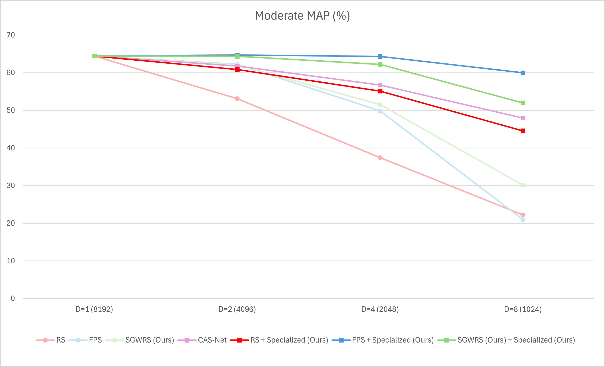
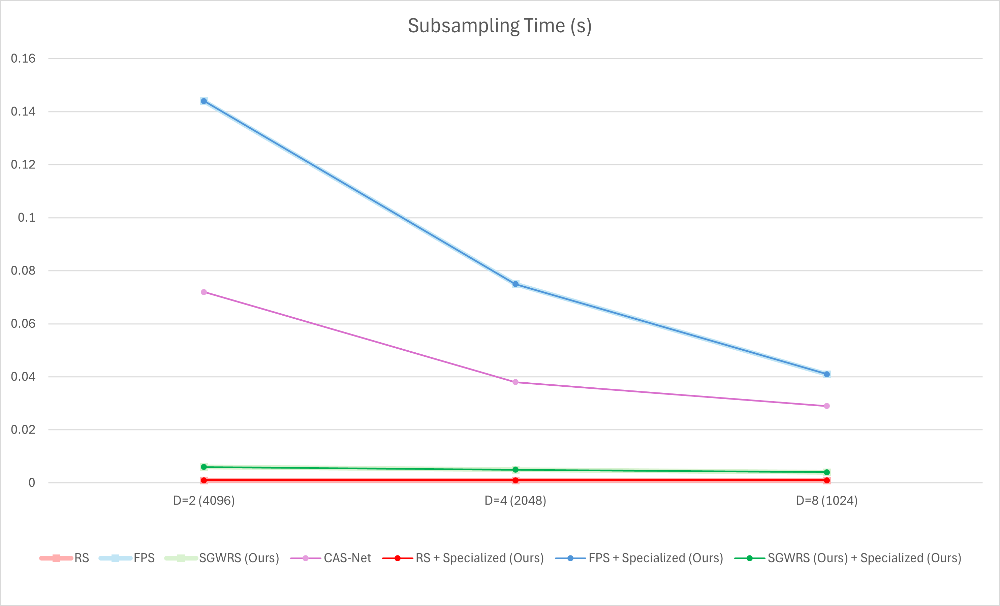

# SGWRS: Spherical Grid-based Weighted Random Subsampling for Real-Time LiDAR 3D Detection

Dense LiDAR point clouds impose a substantial computational and memory burden, which limits real-time 3D object detection on edge platforms. While point cloud downsampling alleviates this cost, many approaches either introduce non-negligible sampling overhead or degrade detection accuracy.

This repository implements a two-part approach:
1. **Sparse-specialized training paradigm**: the detector is explicitly trained for sparse inputs using **dynamic subsampling** as data augmentation.
2. **SGWRS (Spherical Grid-based Weighted Random Subsampling)**: a data-aware sampler that leverages a spherical grid and the **Gumbel–Max trick** to obtain Random-Sampling-level runtime while preserving long-range geometry via inverse-density weighting.

Experiments on **KITTI** with a **PointPillars** backbone demonstrate a strong speed–accuracy trade-off compared to classical and learning-based sampling baselines.

- Dataset: KITTI (Object Detection) — http://www.cvlibs.net/datasets/kitti/
- PointPillars: paper + reference implementation — https://arxiv.org/pdf/1812.05784 , https://github.com/zhulf0804/PointPillars
- CAS-Net baseline: paper + code — https://ieeexplore.ieee.org/stamp/stamp.jsp?arnumber=10219688 , https://github.com/yuanhui0325/CAS-Net

---

## Backbone: PointPillars

We build our experiments on **PointPillars** (Lang et al., CVPR 2019), a fast LiDAR 3D detector that converts point clouds into a **pillar-based pseudo-image** on the ground plane. Pillars are encoded by a lightweight **PointNet-style** feature encoder, followed by an efficient **2D CNN backbone** and a **single-shot detection head** for 3D bounding box prediction. By avoiding expensive 3D convolutions, PointPillars remains a strong real-time baseline for autonomous driving.

We thank the original PointPillars authors and the community for enabling reproducible and efficient LiDAR detection research.

---

## Baselines

We compare four PointPillars pipelines: **SGWRS (ours)** and three baselines—**Random Sampling (RS)**, **Farthest Point Sampling (FPS)**, and **CAS-Net**.

- **RS**: Uniformly samples a fixed number of points at random. Extremely fast, but may under-sample sparse/distant regions.
- **FPS**: Iteratively selects points maximizing minimum distance to the selected set, improving coverage at the cost of high runtime.
- **CAS-Net**: Learnable attention-based sampling. Can retain informative points, but adds model complexity and sampling overhead.

---

## Docker Environment (GPU)

To ensure reproducibility, we provide a Docker-based runtime.

**Included files**
- `Dockerfile` — GPU-enabled PyTorch/CUDA environment.
- `build_docker.sh` — builds the image.
- `run_docker.sh` — runs the container with GPU support and mounts the repo + KITTI.

**Usage**
```bash
./build_docker.sh
./run_docker.sh
````

---

## Setup (after Docker is running)

### 1) Build compiled extensions (inside the container)

```bash
sudo su
python setup.py build_ext --inplace
```

### 2) Fix host-side permissions (on the host)

Ensure the repo directory is writable through the mounted volume:

```bash
sudo chmod -R 775 sgwrs
```

### 3) KITTI preprocessing (inside the container)

Preprocessing is a two-stage pipeline.

**(a) Reduce LiDAR to camera field-of-view**

```bash
python pre_process_kitti.py --data_root /path/to/kitti
```

`--data_root` must be the KITTI path **as mounted inside the container**.

Outputs:

```
kitti/
├── kitti-reduced_gt_database/
├── training/
│   └── velodyne_reduced/
├── testing/
│   └── velodyne_reduced/
├── kitti-reduced_infos_train.pkl
├── kitti-reduced_infos_val.pkl
├── kitti-reduced_infos_trainval.pkl
├── kitti-reduced_dbinfos_train.pkl
```

**(b) Crop reduced point clouds into n spatial segments**

```bash
python pre_process_kitti_crop.py --data_root /path/to/kitti
```

Outputs:

```
kitti/
├── training/
│   └── velodyne_cropped/
├── testing/
│   └── velodyne_cropped/
├── kitti_infos_train.pkl
├── kitti_infos_val.pkl
├── kitti_infos_trainval.pkl
├── kitti_dbinfos_train.pkl
```

---

## Training

Example: **train with SGWRS** at 1024 points (D=8):

```bash
python train.py --data_root /path/to/kitti --ds_mode sgwrs --ds_num 1024
```

<details>
<summary><strong>Training arguments</strong></summary>

* `--data_root` (`str`, default: `kitti_data`) — KITTI root path.
* `--saved_path` (`str`, default: `_pillar_logs_tmp`) — output directory for logs/checkpoints.
* `--batch_size` (`int`, default: `8`) — batch size.
* `--num_workers` (`int`, default: `4`) — DataLoader workers.
* `--nclasses` (`int`, default: `3`) — KITTI classes (Car / Pedestrian / Cyclist).
* `--init_lr` (`float`, default: `2.5e-4`) — initial learning rate.
* `--max_epoch` (`int`, default: `160`) — total epochs.
* `--log_freq` (`int`, default: `8`) — logging frequency (steps).
* `--ckpt_freq_epoch` (`int`, default: `20`) — checkpoint frequency (epochs).
* `--resume_epoch` (`int`, default: `0`) — resume from epoch.
* `--ds_mode` (`str`, default: `none`) — subsampling mode: `none`, `rs`, `fps`, `cn`, `sgwrs`.
* `--ds_num` (`int`, default: `1024`) — number of points retained after sampling.
* `--no_cuda` (flag) — disable CUDA.

</details>

---

## Evaluation

Example: **evaluate SGWRS** at 1024 points:

```bash
python evaluate.py --data_root /path/to/kitti --ckpt /path/to/checkpoint.pth --ds_mode sgwrs --ds_num 1024
```

<details>
<summary><strong>Evaluation arguments</strong></summary>

* `--data_root` (`str`, default: `kitti_data`) — KITTI root path.
* `--ckpt` (`str`, default: `pretrained_legacy/epoch_160.pth`) — checkpoint path.
* `--saved_path` (`str`, default: `_results_tmp`) — output directory for predictions.
* `--batch_size` (`int`, default: `8`) — batch size.
* `--num_workers` (`int`, default: `4`) — DataLoader workers.
* `--nclasses` (`int`, default: `3`) — number of classes.
* `--ds_mode` (`str`, default: `none`) — subsampling mode: `none`, `rs`, `fps`, `cn`, `sgwrs`.
* `--ds_num` (`int`, default: `1024`) — number of retained points.
* `--no_cuda` (flag) — disable CUDA.
* `--save_ds_pcd` (flag) — save downsampled point clouds + calibration for visualization.

</details>


The trained model checkpoints are available here: [https://drive.google.com/drive/folders/1upACqyq26IpGa_9ccBzdfruqI7USgyml](https://drive.google.com/drive/folders/1upACqyq26IpGa_9ccBzdfruqI7USgyml)
> Download the desired `.pth` file and pass its path to the `--ckpt` argument.

---

## Results (KITTI)

We evaluate **SGWRS (ours)** against **RS**, **FPS**, and **CAS-Net** under downsampling ratios
**D ∈ {1, 2, 4, 8}**, corresponding to **{8192, 4096, 2048, 1024}** retained points.

**Protocol**

* For **RS/FPS/SGWRS**, we report:

  * **No retraining**: evaluate a PointPillars checkpoint trained on full point clouds.
  * **Specialized (ours)**: retrain using the proposed sparse-specialized training paradigm.
* For **CAS-Net**, only the **retrained** configuration is meaningful (sampling is part of the learned pipeline).

### Prediction outputs

Raw prediction outputs (3D boxes for all evaluated frames):
[https://drive.google.com/drive/folders/10oz6Zbbh9h8zRno7hZrJhYzMDDTE7LCd](https://drive.google.com/drive/folders/10oz6Zbbh9h8zRno7hZrJhYzMDDTE7LCd)

### Detection accuracy (bbox_3d, moderate mAP %)

| Category                   | Method                         | D=1 (8192) | D=2 (4096) | D=4 (2048) | D=8 (1024) |
| -------------------------- | ------------------------------ | ---------: | ---------: | ---------: | ---------: |
| Conventional subsampling   | RS                             |      64.46 |      53.12 |      37.45 |      22.22 |
| Conventional subsampling   | FPS                            |      64.46 |      62.24 |      49.85 |      20.94 |
| Conventional subsampling   | **SGWRS (ours)**               |      64.46 |      62.08 |      51.53 |      30.14 |
| State-of-the-art           | CAS-Net                        |      64.46 |      61.79 |      56.74 |      47.97 |
| Proposed training paradigm | RS + Specialized (ours)        |      64.46 |      60.83 |      55.12 |      44.56 |
| Proposed training paradigm | FPS + Specialized (ours)       |      64.46 |      64.70 |      64.32 |      59.97 |
| Proposed training paradigm | **SGWRS + Specialized (ours)** |      64.46 |      64.37 |      62.20 |      51.97 |

<details>
<summary>Chart (accuracy)</summary>



</details>

Full KITTI evaluation dumps (all metrics / difficulties):
[https://drive.google.com/drive/folders/18QJxFkWjThhkmTmVRdKut0XfzHoB5z4R](https://drive.google.com/drive/folders/18QJxFkWjThhkmTmVRdKut0XfzHoB5z4R)

### Subsampling overhead (seconds per frame)

| Category                   | Method                         | D=1 (8192) | D=2 (4096) | D=4 (2048) | D=8 (1024) |
| -------------------------- | ------------------------------ | ---------: | ---------: | ---------: | ---------: |
| Conventional subsampling   | RS                             |          - |      0.001 |      0.001 |      0.001 |
| Conventional subsampling   | FPS                            |          - |      0.144 |      0.075 |      0.041 |
| Conventional subsampling   | **SGWRS (ours)**               |          - |      0.006 |      0.005 |      0.004 |
| State-of-the-art           | CAS-Net                        |          - |      0.072 |      0.038 |      0.029 |
| Proposed training paradigm | RS + Specialized (ours)        |          - |      0.001 |      0.001 |      0.001 |
| Proposed training paradigm | FPS + Specialized (ours)       |          - |      0.144 |      0.075 |      0.041 |
| Proposed training paradigm | **SGWRS + Specialized (ours)** |          - |      0.006 |      0.005 |      0.004 |

<details>
<summary>Chart (runtime)</summary>



</details>

### Observations

* SGWRS provides a favorable speed–accuracy trade-off, outperforming naive RS at comparable overhead.
* FPS yields strong coverage but incurs substantially higher sampling time.
* Sparse-specialized training significantly mitigates the performance drop induced by aggressive downsampling, highlighting the importance of detector specialization for sparse inputs.
